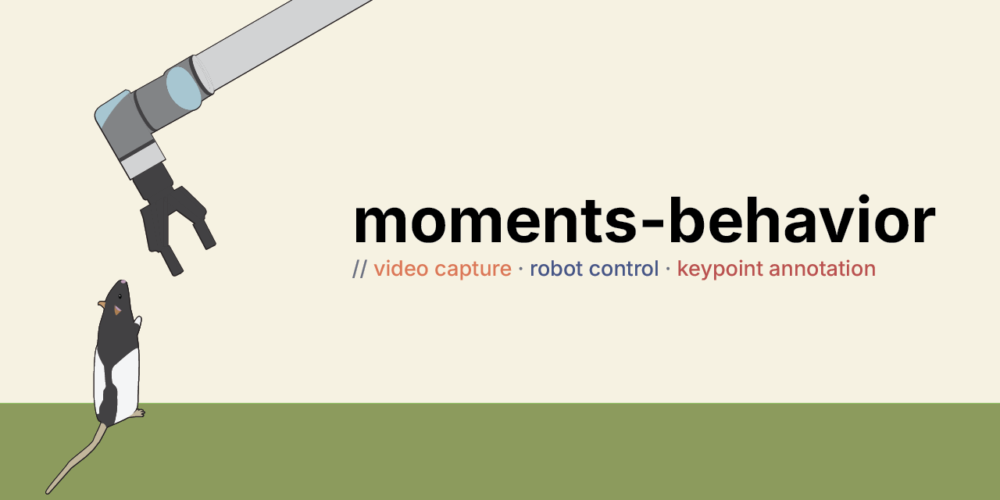

  

# moments-behavior

A toolkit for recording and annotating animal behavior in
neuroscience research — video capture, robot control, and
keypoint annotation.

## Projects

- **[orange](https://github.com/moments-behavior/orange)** — video capture
- **[indigo](https://github.com/moments-behavior/indigo)** — robot control *(coming soon)*
- **[red](https://github.com/moments-behavior/red)** — keypoint annotation

## Citation

Please cite the relevant repository:

- **orange**: [10.5281/zenodo.19688150](https://doi.org/10.5281/zenodo.19688150)
- **red**: [10.5281/zenodo.19688190](https://doi.org/10.5281/zenodo.19688190)

A paper describing the full toolkit is in preparation.

## Lab

The toolkit is developed at the [Johnson Lab](https://www.janelia.org/lab/johnson-lab)
at [HHMI Janelia Research Campus](https://www.janelia.org).

For questions, please contact [Jinyao Yan](yanj11@janelia.hhmi.org)
or open an issue on the relevant repository.
